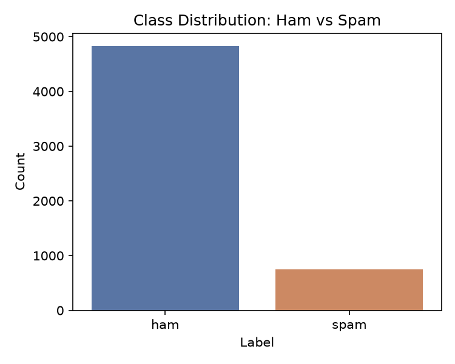
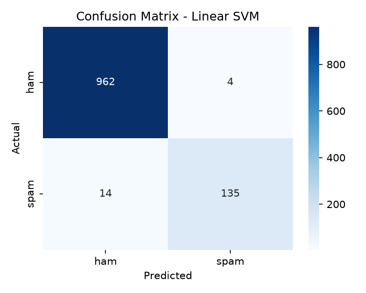
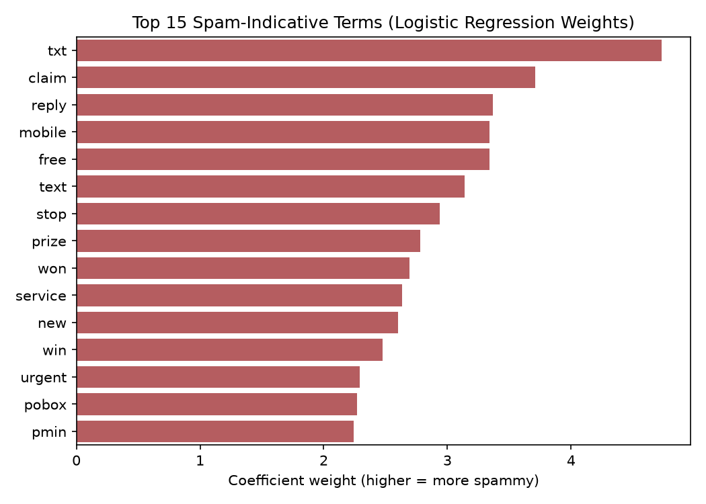

# SMS Spam Classification

An end-to-end machine-learning project that classifies **SMS-style text messages** as spam or ham (not spam). It includes reproducible data download and training scripts, model comparison, evaluation plots, saved model artifacts, and a Streamlit interface for interactive predictions.

> This model was trained on SMS messages—not a full email corpus—and should not be presented or used as a production email-security filter.

## What this project demonstrates

- Text normalization shared between training and inference
- TF-IDF features using unigrams and bigrams
- Comparison of Multinomial Naive Bayes, Logistic Regression, and Linear SVM
- Evaluation using accuracy, precision, recall, F1 score, confusion matrices, and ROC curves
- Model serialization with Joblib
- Interactive inference with Streamlit

## Dataset and experiment

The project uses the [SMS Spam Collection Dataset](https://archive.ics.uci.edu/dataset/228/sms+spam+collection), containing 5,572 labelled messages:

- 4,825 ham messages
- 747 spam messages
- 80/20 stratified train/test split
- Fixed random seed: `42`
- TF-IDF vocabulary limited to 3,000 features

Stratification preserves the imbalanced class ratio in both splits. Because missing a spam message is important, recall and F1 score should be considered alongside accuracy.

## Results

These values match the committed `results_summary.txt` generated by the training script.

| Model | Accuracy | Precision | Recall | F1 |
|---|---:|---:|---:|---:|
| Multinomial Naive Bayes | 97.31% | 100.00% | 79.87% | 0.8881 |
| Logistic Regression | 96.77% | 100.00% | 75.84% | 0.8626 |
| **Linear SVM** | **98.39%** | **97.12%** | **90.60%** | **0.9375** |

Linear SVM is selected by F1 score. Its decision-function output is **not a calibrated probability**, so the interface deliberately does not display it as a confidence percentage.

## Evaluation visuals

| Class distribution | Confusion matrix | Top spam terms |
|---|---|---|
|  |  |  |

Additional plots, including model comparison, ROC curves, and sample predictions, are available in the [screenshots directory](screenshots).

## Project structure

```text
.
├── app.py                       # Streamlit inference interface
├── spam_classifier.py           # Training and evaluation pipeline
├── text_utils.py                # Shared preprocessing logic
├── download_data.py             # Dataset download script
├── requirements.txt             # Runtime/training dependencies
├── requirements-dev.txt         # Test dependencies
├── results_summary.txt          # Metrics from the recorded experiment
├── spam_classifier_model.joblib # Saved best model
├── tfidf_vectorizer.joblib      # Saved TF-IDF vectorizer
├── screenshots/                 # Generated evaluation figures
└── tests/test_text_utils.py     # Preprocessing tests
```

## Setup

Python 3.10 or newer is recommended.

```bash
git clone https://github.com/Ali18-code/email-spam-classification.git
cd email-spam-classification

python -m venv .venv
```

Activate the environment:

```bash
# Windows PowerShell
.venv\Scripts\Activate.ps1

# macOS/Linux
source .venv/bin/activate
```

Install dependencies:

```bash
python -m pip install --upgrade pip
pip install -r requirements.txt
```

## Run the application

The repository includes saved model artifacts:

```bash
streamlit run app.py
```

The application currently runs locally. Add a public demo URL here only after deploying and verifying it.

## Reproduce training

```bash
python download_data.py
python spam_classifier.py
```

Training regenerates the saved model, vectorizer, result summary, and evaluation plots. Results may vary if the dataset, dependencies, preprocessing, or random seed changes.

## Run tests

```bash
pip install -r requirements-dev.txt
pytest -q
```

## Limitations

- The dataset contains short SMS messages, so performance does not establish accuracy on full emails.
- Accuracy can look strong on an imbalanced dataset; spam recall and false negatives remain important.
- Removing numbers and punctuation may discard useful spam signals.
- The evaluation uses one fixed train/test split rather than cross-validation.
- Linear SVM scores are not calibrated probabilities.
- Spam language changes over time, so real-world performance may degrade through dataset shift.
- This educational model should not replace security software or human review.

## Possible next improvements

- Add cross-validation and confidence intervals
- Inspect and document false-negative examples
- Compare character n-grams with word-level TF-IDF
- Calibrate the selected classifier before displaying probabilities
- Add inference and model-loading integration tests
- Deploy the Streamlit application and add its verified URL

## Tech stack

Python, Streamlit, pandas, NumPy, scikit-learn, Matplotlib, Seaborn, Joblib, pytest

## License and dataset attribution

The source code is provided for educational and portfolio use. Review the dataset's original terms and citation requirements before redistribution or commercial use.
