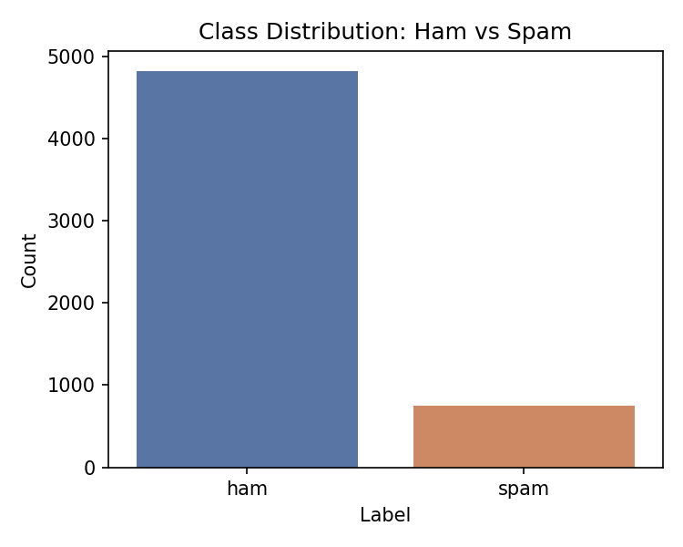
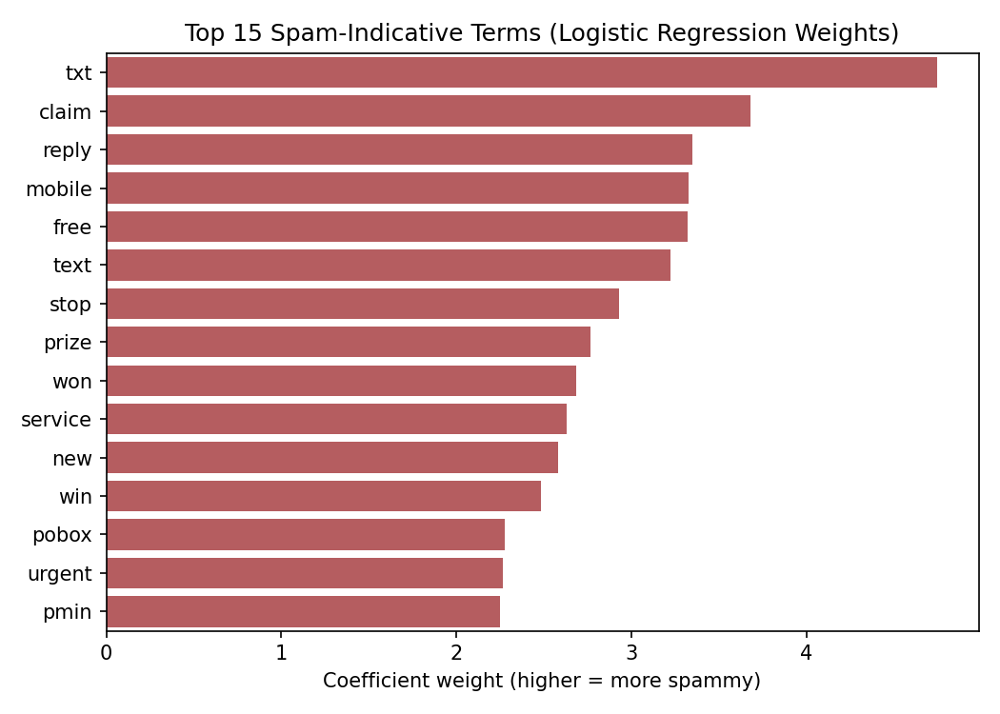

# Email/SMS Spam Classification

A machine learning pipeline that classifies text messages as **spam** or **ham** (not spam) using classic NLP preprocessing, TF-IDF feature extraction, and multiple classifiers.

## Overview

- **Dataset:** [SMS Spam Collection Dataset](https://www.kaggle.com/datasets/uciml/sms-spam-collection-dataset) (Kaggle) — 5,572 labelled messages (4,825 ham / 747 spam)
- **Preprocessing:** lowercasing, URL/number/punctuation removal, whitespace normalization
- **Features:** TF-IDF (unigrams + bigrams, English stop words removed, 3,000-feature vocabulary)
- **Models compared:** Multinomial Naive Bayes, Logistic Regression, Linear SVM
- **Best result:** Linear SVM — **98.39% accuracy**, F1 score 0.937

## Project Structure

```
email-spam-classification/
├── spam_classifier.py     # Main script: preprocessing, training, evaluation
├── download_data.py       # Fetches the dataset (sms_spam.tsv)
├── requirements.txt       # Python dependencies
├── results_summary.txt    # Generated metrics summary (created after running)
└── screenshots/           # Generated charts and plots (created after running)
```

## Setup & Usage

```bash
# 1. Clone the repo and move into this folder
git clone <your-repo-url>
cd email-spam-classification

# 2. Install dependencies
pip install -r requirements.txt

# 3. Download the dataset
python download_data.py

# 4. Run the pipeline
python spam_classifier.py
```

Running the script will:
1. Load and clean the raw text data
2. Extract TF-IDF features
3. Train and evaluate three classifiers
4. Save all charts to `screenshots/` and a metrics summary to `results_summary.txt`

## Results

| Model                   | Accuracy | Precision | Recall | F1 Score |
|--------------------------|----------|-----------|--------|----------|
| Multinomial Naive Bayes  | 97.22%   | 100.00%   | 79.19% | 0.884    |
| Logistic Regression      | 96.95%   | 100.00%   | 77.18% | 0.871    |
| **Linear SVM (best)**    | **98.39%** | 97.81%  | 89.93% | **0.937** |

### Sample Outputs

| Class Distribution | Confusion Matrix | Top Spam Words |
|---|---|---|
|  |  |  |

## Tech Stack

Python, pandas, NumPy, scikit-learn, matplotlib, seaborn

## License

This project is for educational/internship purposes.
